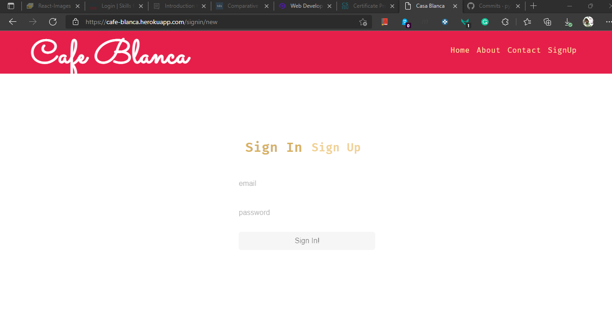

# Capstone Project - Cafeteria Management

Developed for AICTE Lite WD 201 Capstone Project. Project is live on [heroku apps](https://cafe-blanca.herokuapp.com/).

## Roles

There are three personas in our Cafeteria system:

- **Cafeteria Owner**: the owner needs complete access of the system. They will add and update stock, create invoices, see all reports and so on. Please find below test admin details

  ```
    admin@example.com
    test12345
  ```

- **Online Customer**: A customer who want to place an order online would want to see a menu from which they can place an order. They would want to see the invoice details and status of their order, but they will not see anything else about the system.

- **Cafeteria Billing Clerk**: The billing clerk is the person taking customer orders directly from the counter. They will be able to create new invoices, print them, and see order status. However they will not be able to modify item details or see reports like income since they will be seen only by the owner. Please find below test clerk details.

```
    testB@example.com
    test12345
```

## Updates and Future Fixes

- made cart functionality with same order table, need to update as suggested viz: _a rough idea on how you can implement this_ from coursework, Both Order and Cart have similar schema. OrderItem and CartItem have similar schema.

```
Order
  has_many :order_items
Cart
  has_many :cart_items
```

## UI/UX Screens

- Home Screen

  

- More to come...
